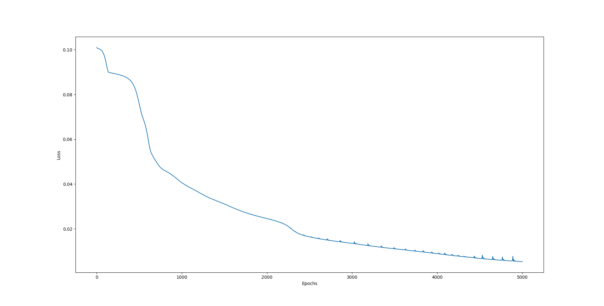
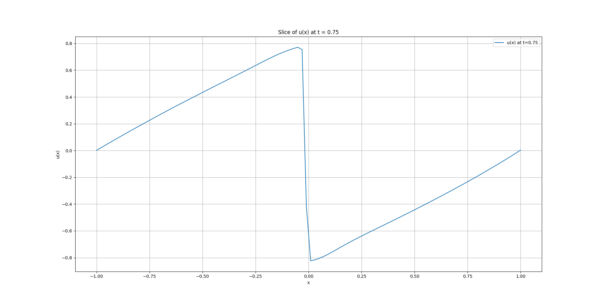
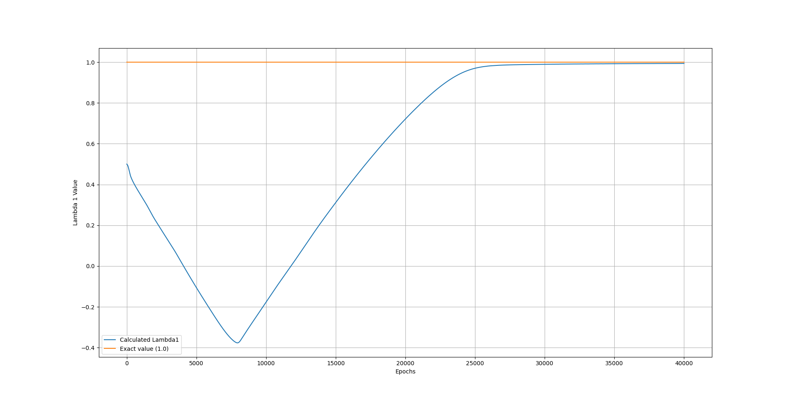
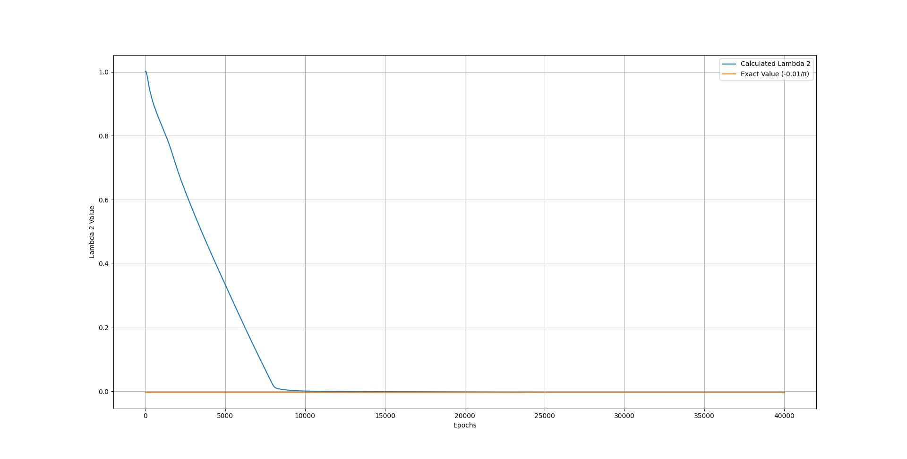

# Physics-Informed Neural Networks for Burgers’ Equation

This repository contains two Python implementations of Physics-Informed Neural Networks (PINNs) applied to the 1D viscous Burgers' equation. The goal is to demonstrate both **forward modeling** and **inverse parameter identification** using deep learning and PDE physics.

---

## Governing Equation

\[
u_t + u u_x - \left(\frac{0.01}{\pi}\right) u_{xx} = 0, \quad x \in [-1, 1], \quad t \in [0, 1]
\]

**Initial and boundary conditions:**
- \( u(0, x) = -\sin(\pi x) \)
- \( u(t, -1) = u(t, 1) = 0 \)

---

## Scripts

### `forward_pinn.py`
Solves the Burgers’ equation using a physics-informed neural network (PINN) that learns \( u(t, x) \) over the domain.

**Results:**
- 
- 
- 

---

### `inverse_pinn.py`
Learns unknown parameters \( \lambda_1 \) and \( \lambda_2 \) in the PDE from spatiotemporal data, while also reconstructing the solution.

**Learned values:**
- \( \lambda_1 \approx 1.0 \)
- \( \lambda_2 \approx -0.01/\pi \)

**Results:**
- 
- 
- 

---

## Project Structure

burgers-pinn/
├── forward_pinn.py # Solves Burgers' equation (PINN)
├── inverse_pinn.py # Learns λ₁ and λ₂ (Inverse PINN)
├── data/
│ └── data.txt # Training data for inverse PINN
├── images/ # Generated result plots
└── README.md

## Dependencies

- PyTorch
- NumPy
- Matplotlib